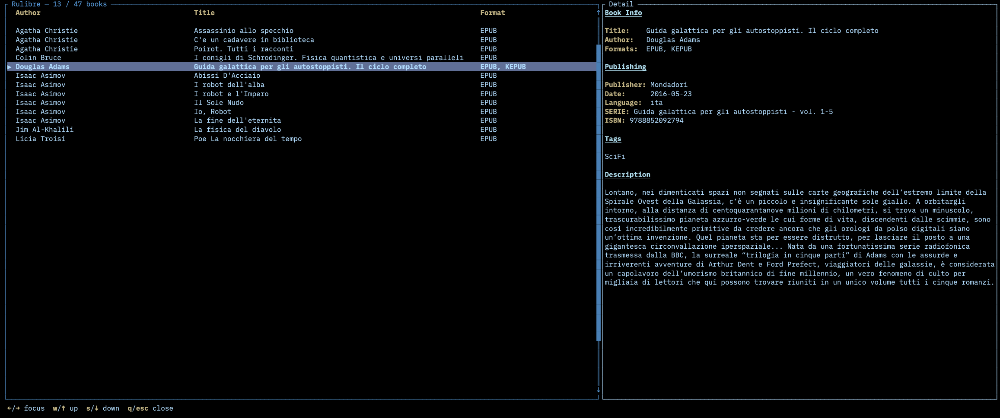

# Rulibre

I got tired of Calibre's old, complex interface and its heavy storage footprint. All I really needed was a way to browse my library and transfer books to my e-reader, so I built a lightweight, drop-in replacement that works with your existing Calibre library structure. I also added things I found lacking or too complicated to use in Calibre, like instant book search.



## Install

```
cargo install --git https://github.com/Glydric/Rulibre
```

To uninstall:

```
cargo uninstall rulibre
```

Or clone and install locally:

```
git clone https://github.com/Glydric/Rulibre.git
cd Rulibre
cargo install --path .
```

Then run with:

```
rulibre
```

## Configuration

On first run, you'll be prompted for your Calibre library path. The path is saved to your system default config path.

## Features

- Browse all books in your Calibre library sorted by author and title
- Search/filter with `/` across author, title, and format
- Detail panel showing metadata parsed from `metadata.opf` (title, author, publisher, date, language, series, tags, description, identifiers)
- Convert books between formats (`c` key) using [kepubify](https://pgaskin.net/kepubify/) or Calibre's `ebook-convert`
- Mouse support: click to select books, scroll both panels
- Keyboard focus switching between table and detail panels

## What gets scanned

The scanner walks `{library}/{author}/{title (id)}/` directories and picks up book files by extension (EPUB, KEPUB, CBZ, PDF, etc.).

Excluded from scanning:
- `.caltrash/`, `.calnotes/`, `.DS_Store`, `downloaded/` (Calibre internal)
- `metadata.opf`, `cover.jpg` inside book folders

## Book conversion

Press `c` on a selected book to convert it to another format. Conversion options are shown based on which tools are installed:

- **kepubify** — used for EPUB → KEPUB conversion. Install from [pgaskin.net/kepubify](https://pgaskin.net/kepubify/)
- **ebook-convert** (Calibre) — used for all other conversions (EPUB, PDF, MOBI, AZW3, KEPUB, DOCX, TXT). Included with [Calibre](https://calibre-ebook.com/)

Only formats you don't already have are offered. If neither tool is installed, the convert dialog will let you know.

## Extra tools

A diagnostic binary is included for checking unrecognized metadata tags:

```
cargo run --bin scan_metadata -- /path/to/calibre/library
```
